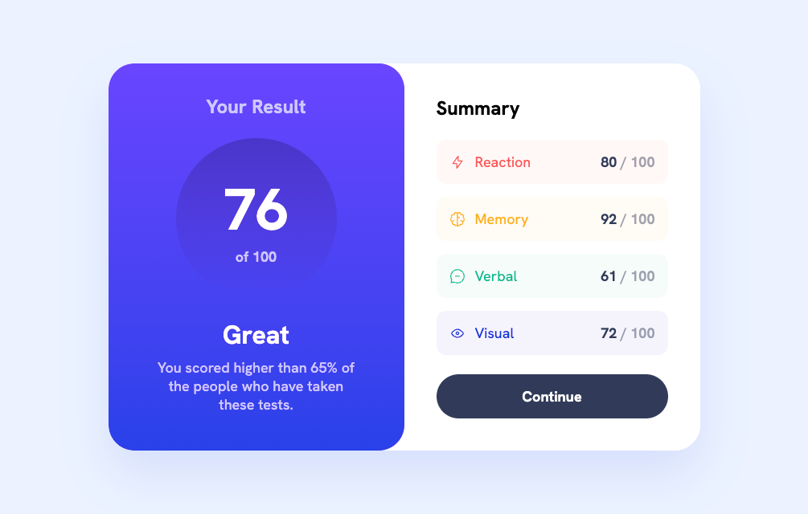

# Frontend Mentor - Results summary component solution

This is a solution to the [Results summary component challenge on Frontend Mentor](https://www.frontendmentor.io/challenges/results-summary-component-CE_K6s0maV). Frontend Mentor challenges help you improve your coding skills by building realistic projects.

## Table of contents

- [Overview](#overview)
  - [The challenge](#the-challenge)
  - [Screenshot](#screenshot)
  - [Links](#links)
- [My process](#my-process)
  - [Built with](#built-with)
  - [What I learned](#what-i-learned)
- [Author](#author)

## Overview

### The challenge

Users should be able to:

- View the optimal layout for the interface depending on their device's screen size
- See hover and focus states for all interactive elements on the page
- **Bonus**: Use the local JSON data to dynamically populate the content

### Screenshot

### Links

- Solution URL: https://github.com/stefan-holmgren/fem-results-summary-component
- Live Site URL: https://stefan-holmgren.github.io/fem-results-summary-component/

## My process

### Built with

- Semantic HTML5 markup
- CSS custom properties
- Flexbox
- CSS Grid
- Vanilla JavaScript

### What I learned

I chose to use javascript, because I saw the `data.json` file, so I thought "what the hey". Created a `template` element and used it to create a `documentFragment` to append to the DOM.

## Author

- Frontend Mentor - [@stefan-holmgren](https://www.frontendmentor.io/profile/stefan-holmgren)
